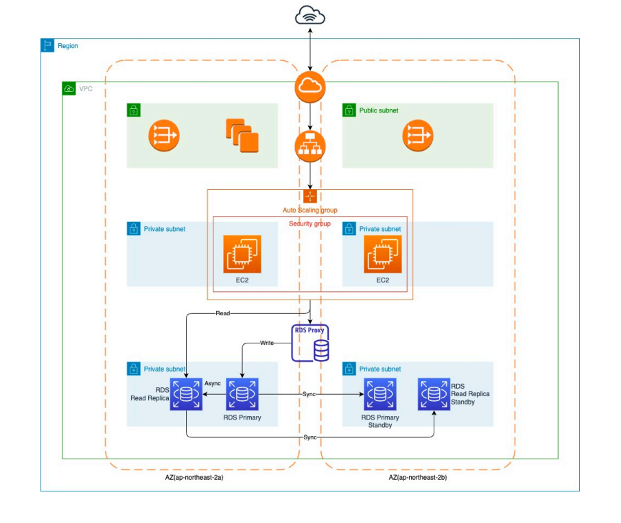

# RDS - 관리형 관계형 데이터베이스

### RDS

Relational Database Service

- AWS에서 제공하는 관계형 데이터베이스 서비스
- PostgreSQL, MySQL, MariaDB, Oracle, Microsoft SQL, AWS Aurora
- 운영적인 부분을 AWS가 관리

### RDS - AWS관리의 장점

- 서버에 접속할 수 없음
- 중단없는 스토리지 오토스케일링
- 편리한 자동, 수동 백업 및 마이그레이션
- Multi AZ 배포, 읽기 전용 복제본, RDS Proxy

### Multi AZ 배포

 

- 여러 가용영역에 복제본 배포
- 고가용성에 유리
- 장애조치 시 조금의 지연시간 발생

### 읽기 전용 복제본

 

- 읽기 트래픽 분산을 위한 복제본
- 메인 DB는 쓰기 트래픽, 읽기 전용 복제본은 읽기 트래픽
- 메인에서 비동기로 데이터를 복사해 일관된 데이터 유지

### RDS Proxy

 

- RDS로 트래픽 분배
- 커넥션 재사용으로 성능 개선
- 연결 시도 모니터링