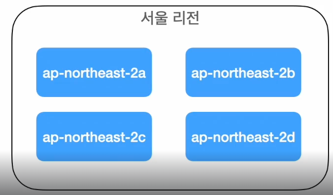

# VPC 보안 네트워크 구축

### VPC란?

Virtual Private Cloud

- 가상의 사설 네트워크 공간
- AWS의 서비스를 배치
- 배치할 서비스에 IP주소를 부여해서 관리
- 외부 인터넷과 통신할 수 있는 공간과 외부로부터 단절된 공간으로 나눠서 관리
- 여러가지 VPC의 구성요소들을 활용해서 보안 강화

### VPC의 주요 구성요소

- 서브넷
- 인터넷 게이트웨이
- NAT 게이트웨이
- 라우팅 테이블
- 보안그룹
- 네트워크 ACL

### AWS Region

- 물리적으로 분리된 AWS 데이터센터의 집합
- 버지니아, 도쿄, 시드니 등 세계 여러 지역에 위치
- 각 지역의 리전은 문자와 숫자로된 이름을 부여
- 서울 리전 - ap-northeast-2

### 가용영역

 

- 하나의 리전을 물리적으로 나눠놓은 데이터센터
- 전력 공급이나 네트워크 연결같이 물리적인 부분을 모두 독립적으로 사용
- 가용영역에서 문제가 발생하면 다른 가용영역에서 서비스
- 서울리전에는 총 4개의 가용영역
- ap-northeast-2a ~ ap-northeast-2d

### 서브넷

- VPC 내부에서 VPC가 가지고 있는 IP범위를 논리적으로 더 작게 나눈 단위
- 무조건 하나의 가용영역에 포함되어야 함
- 퍼블릭 서브넷, 프라이빗 서브넷 두가지 종류가 존재
    - 보안과 가용성을 위해 배치해서 사용

### 인터넷 게이트웨이

 

- VPC 내에서 외부 인터넷과 통신할 수 있게 해주는 서비스
- VPC 내부의 리소스가 외부로 나갈 수 있고,
- 외부 인터넷에서 VPC 내부 리소스로 접근할 때 필요
- VPC 단위로 배치

### NAT 게이트웨이

 

- VPC 내부의 리소스가 외부 인터넷으로 나갈 수 있게 해주는 서비스
- 인터넷 게이트웨이와 다르게 외부 인터넷에서 내부로 접근할 수는 없음
- 주로 보안을 강화하기 위해 사용

### NAT 게이트웨이 통신

 

### 라우팅 테이블

 

- 서브넷의 트래픽을 어떻게 어디로 전달할지 정의하는 요소
- 서브넷에 연결
- 퍼블릭 서브넷의 라우팅 테이블은 인터넷 게이트웨이에 라우팅 되도록 정의
- 프라이빗 서브넷 라우팅 테이블은 NAT 게이트웨이에 라우팅 되로록 정의

### 라우팅 테이블 다이어그램

 

### VPC의 구성요소를 이용한 다이어그램

 

### CIDR

Classless Inter-Domain Routing

- 도메인간 라우팅 기법
- 도메인간의 라우팅에 사용되는 인터넷 주소를 원래 IP주소 클래스 체계를 쓰는 것보다 더욱 능동적으로 할당하여 지정하는 방식

VPC CIDR 블록 (10.0.0.0/16)과 서브넷 CIDR 블록 (10.1.0.0/24, 10.0.1.0/24) 관계 이해

- VPC CIDR 블록: VPC 전체에서 사용 가능한 IP 주소 범위를 정의합니다. 10.0.0.0/16은 10.0.0.0부터 10.0.255.255까지의 IP 주소를 포함합니다.
- 서브넷 CIDR 블록: VPC 내에서 논리적으로 분리된 네트워크 (서브넷)에 할당되는 IP 주소 범위를 정의합니다. 서브넷 CIDR 블록은 VPC CIDR 블록 범위 내에 존재해야 합니다.

**10.1.0.0/24가 안 되는 이유**

- 10.1.0.0/24는 10.1.0.0부터 10.1.0.255까지의 IP 주소를 포함합니다. 이 범위는 VPC CIDR 블록 (10.0.0.0/16) 범위를 벗어나므로 서브넷 CIDR 블록으로 사용할 수 없습니다.

**10.0.1.0/24가 되는 이유**

- 10.0.1.0/24는 10.0.1.0부터 10.0.1.255까지의 IP 주소를 포함합니다. 이 범위는 VPC CIDR 블록 (10.0.0.0/16) 범위 내에 존재하므로 서브넷 CIDR 블록으로 사용할 수 있습니다.

### 네트워크 주소와 호스트 주소

10.0.0.0/16 사용시  10.1.0~255.0.0~255

10.0.0.0/24 사용시 10.0.0.0~255

10.0.1.0/16 사용시  10.0.1.0~255

단, 하지만 AWS VPC에서는 0~4, 마지막 IP주소는 예약되어 251개 IP 사용 가능

[[Subnet mask] 서브넷, 서브넷마스크, 서브넷팅에 대해서 !](https://louis-j.tistory.com/entry/Subnet-mask-서브넷-서브넷마스크-서브넷팅에-대해서)

- **네트워크 주소:** 특정 네트워크 또는 서브넷을 식별하는 데 사용됩니다. 라우터는 네트워크 주소를 기반으로 데이터 패킷을 올바른 네트워크로 전달합니다.
- **호스트 주소:** 네트워크 내의 개별 장치(컴퓨터, 스마트폰 등)를 식별하는 데 사용됩니다. 각 장치는 고유한 호스트 주소를 가지며, 이를 통해 다른 장치와 통신할 수 있습니다.

 **표현 방식:**

- **네트워크 주소:** CIDR 표기법에서 `/` 뒤의 숫자에 따라 네트워크 주소의 비트 수가 결정됩니다. 예를 들어, `/24`는 처음 24비트가 네트워크 주소임을 나타냅니다.
- **호스트 주소:** CIDR 표기법에서 네트워크 주소를 제외한 나머지 비트가 호스트 주소를 나타냅니다. 예를 들어, `/24`에서는 나머지 8비트가 호스트 주소입니다.

### 인터넷 게이트웨이 - NAT 게이트웨이 - 서브넷 - 라우팅 테이블 설정

 